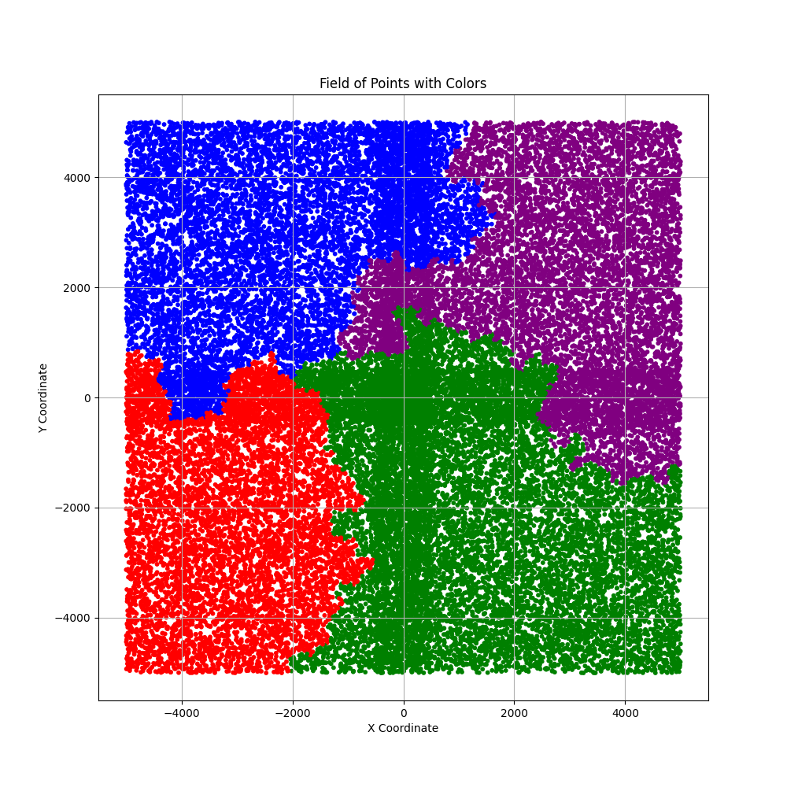
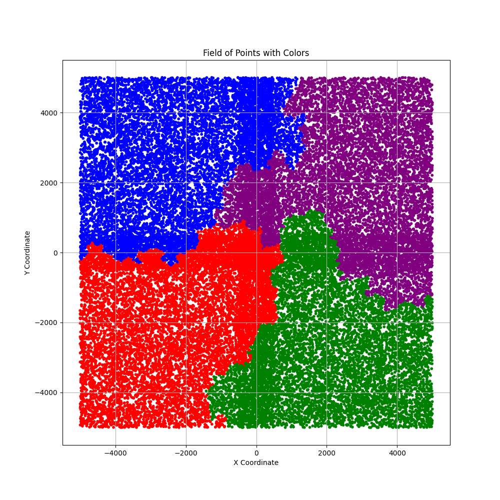
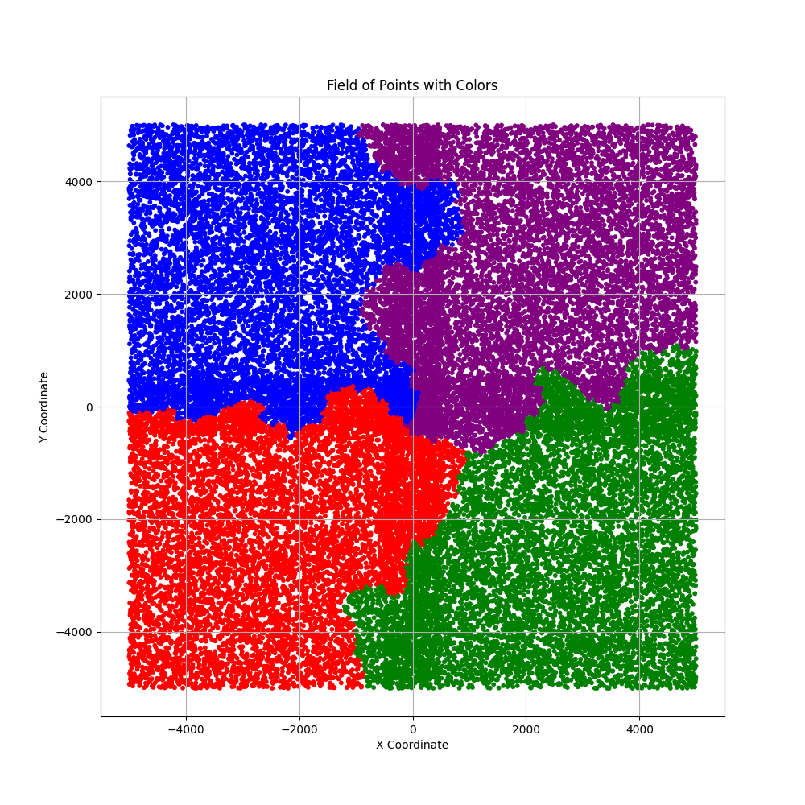
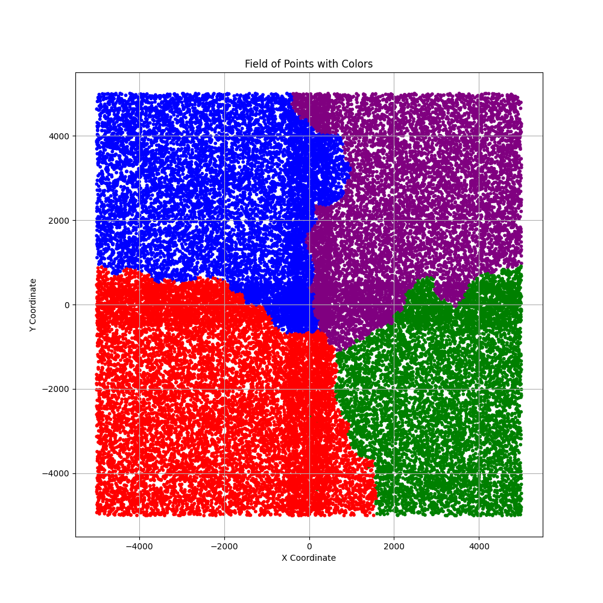
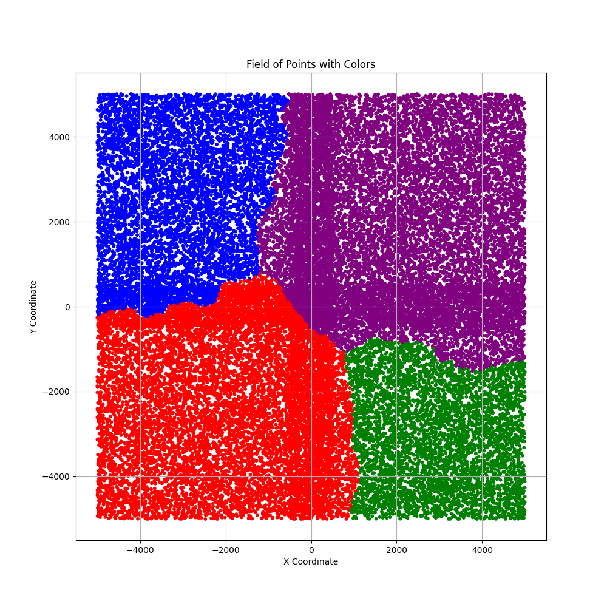

# Project Documentation

## Project Goal
The objective of this project is to fill a large matrix (10,000 x 10,000 grid) with 40,000 points, each assigned one of four colors: red, blue, green, and purple. This matrix is divided into four distinct color-based sections, and each point's color is influenced by the colors of its `k` nearest points.

## Algorithm Workflow
- **Matrix Initialisation** - Create 40000 uniquely placed points, without color, and 8 basic points.
- **Points Coloring** - Color each point.
- **Results printing** - Print the results of the coloring process, and the accuracy of the coloring process.

## Matrix Structure
- **Matrix Dimensions**: 10,000 x 10,000 grid, with coordinates ranging from -5000 to +5000.
- **Sections**: The matrix is divided into four quadrants, each representing one of the colors (red, blue, green, purple).
- **Point Placement**: Points are distributed randomly across the matrix, with constraints to ensure no two points occupy the same location.
- **Matrix Realisation**: The matrix is represented as a dictionary of x, y tupple, and a Point object. So only selected points are stored.

## Unique Point Placement
Each point in the matrix must have a unique position. The algorithm for ensuring unique point placement is designed to avoid collisions:
1. **Random Position Generation**: Initially, each point is assigned a random position within the matrix bounds, and within its section bound.
2. **Collision Detection**: The algorithm will generate new points until a unique position is found.
3. **Efficient Data Structure**: A dictionary is used to quickly check for the presence of points at specific positions.

## Color Selection Process
The color of each new point is determined by examining the colors of its `k` nearest neighbors, following these steps:
1. **k-Nearest Neighbor Search**: Identify the `k` closest points to the new point using a spatial data structure (e.g., KD-tree) for efficient querying.
2. **Color Voting System**: Based on the colors of these `k` neighbors, the most suitable color is assigned to the new point.

*Detailed explanations of both the nearest neighbor search and color selection algorithms are provided in the corresponding sections.*

## Algorithm for Finding k-Nearest Points
The `k`-nearest points for each new point are found using an optimized nearest-neighbor search algorithm. The KD-tree structure is used to perform spatial searches efficiently. Steps involved:
1. **Insertion**: Points are inserted recursively based on alternating axes (x or y).
2. **k-Nearest Neighbors Search**: The algorithm finds the k nearest points to a given target by traversing the KD-tree and backtracking when necessary. A max heap is used to store the k nearest points, with each point’s distance from the target. When a new point closer than the farthest point in the heap is found, it replaces the farthest point in the heap. This ensures that, by the end of the traversal, only the k closest points remain in the heap.

## Color Selection Algorithm
The color of each point is influenced by the colors of its `k` nearest points. The process involves:
1. **Used Collection**: A dictionary is used to store the weight of each color among the `k` nearest points. 
2. **Distance Count**: Count distances to each of the `k` nearest points.
3. **Weight calculation** - The weight of each color is calculated based on the distance to the new point.
3. **Color Assignment**: The color of the new point is determined by the color with the highest weight among the `k` nearest points.

## Accuracy Calculation
To assess the accuracy of the color assignment process, an accuracy calculation algorithm is employed
**Accuracy Metric**: Accuracy is measured by calculating the percentage of points that match the expected color based on their section.

## Results of Experiments
Results are based on different factors, such as the number of basic points, the k value, and of course random factors, like order of points creation.

1. **Basic points** Basic points influence a lot on final result. The more basic points created, and the better their positions are, the better final solution is.
2. **k value** The k value is the number of nearest points that influence the color of the new point. The higher the k value, the more accurate the coloring process, and the more "straight", and smooth borders between each section are(example below).
<div style="text-align: center;">
    
    
</div>

# Example of the Coloring Process

## Test 1

### - K1


```
Color 1: 7280/7370 (98.78%)
Color 2: 11722/14476 (80.98%)
Color 3: 8510/9082 (93.70%)
Color 4: 8272/9112 (90.78%)
```

### - K3


```
Color 1: 10595/10908 (97.13%)
Color 2: 8721/9386 (92.91%)
Color 3: 9160/9635 (95.07%)
Color 4: 9259/10111 (91.57%)
```

### - K7


```
Color 1: 9392/9534 (98.51%)
Color 2: 9552/10080 (94.76%)
Color 3: 9597/9735 (98.58%)
Color 4: 10385/10691 (97.14%)
```

### - K15


```
Color 1: 11879/12768 (93.04%)
Color 2: 7446/7583 (98.19%)
Color 3: 9904/10197 (97.13%)
Color 4: 9295/9492 (97.92%)
```

### - K30 optional


```
Color 1: 11697/12371 (94.55%)
Color 2: 5177/5177 (100.00%)
Color 3: 7044/7044 (100.00%)
Color 4: 13869/15448 (89.78%)
```

